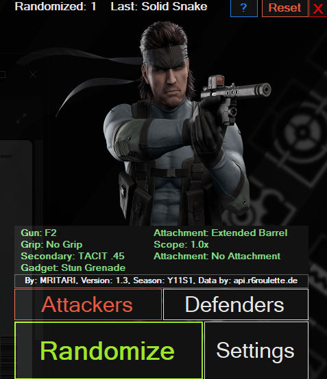
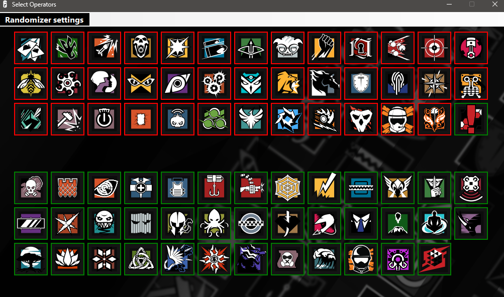

# Rainbow Six Siege Randomizer

---

## Downloads

  

---

## 📢 Credits
**Operator data provided by [R6 Roulette / Panda-Network](https://r6roulette.de/).**  
Special thanks to the R6 Roulette team for providing API access to keep this tool up-to-date with the latest seasons.

---

## Changelog

### v1.3.0 (Latest)
- **YEAR 11 SEASON 1 — Operation Silent Hunt**
- Added new operator: **Solid Snake**
- **Live API Integration**: The app now syncs directly with R6 Roulette to get the latest operator data.
- **Auto-Caching**: Data is fetched once at startup and cached locally to ensure fast performance and offline support.

### v1.2.1 
- Added loadout randomizer (Primary/Secondary weapons, Attachments, Grips, Scopes, and Gadgets).

### v1.2.0
- **YEAR 10 SEASON 3 — Operation High Stakes**
- Added new operator: **Leon "Denari" Winzenried**.
- Transparent for an overlay-like look.
- Updated hotkey logic (`Shift + F5` to toggle visibility).
- Overlay now locks to the top-right corner of the screen.

---

## Screenshots 

### Main Window 
 

### Settings Menu 
 

---

## Overview
The **R6 Randomizer** is your go-to companion for Rainbow Six Siege, helping you pick a random operator for **Attackers** or **Defenders**.  
It’s a quick way to keep your gameplay fresh and unpredictable, with full control over which operators are included.

---

## Key Features

### 🎲 Randomize Button
- Click **Randomize** to select a random operator from your enabled list.  
- Displays the chosen operator’s portrait and details in the main window.  
- Prevents the same operator from being chosen again until you reset the app.

### ⚙️ Operator Management
- Click **Settings** to view the full operator roster.  
- **Green border** = enabled, **Red border** = disabled.  
- Click an operator’s icon to toggle its status.  
- Changes are **saved automatically** and persist between launches.

### 🖥️ In-Game Overlay
- **Press `Shift + F5`** to toggle the app’s visibility while playing.  
- Designed to work best in **borderless windowed mode**.
- Overlay stays in the top-right corner and can be hidden when not needed.

---

## Troubleshooting

### API Fetch Failed
- Ensure your firewall isn't blocking the application.
- If the API is down, the app will automatically use the last cached version of the operator list.

### Overlay Not Showing In-Game
- Use **borderless windowed mode** for best results.
- Ensure the hotkey doesn’t conflict with another application (like Discord or GeForce Experience).
