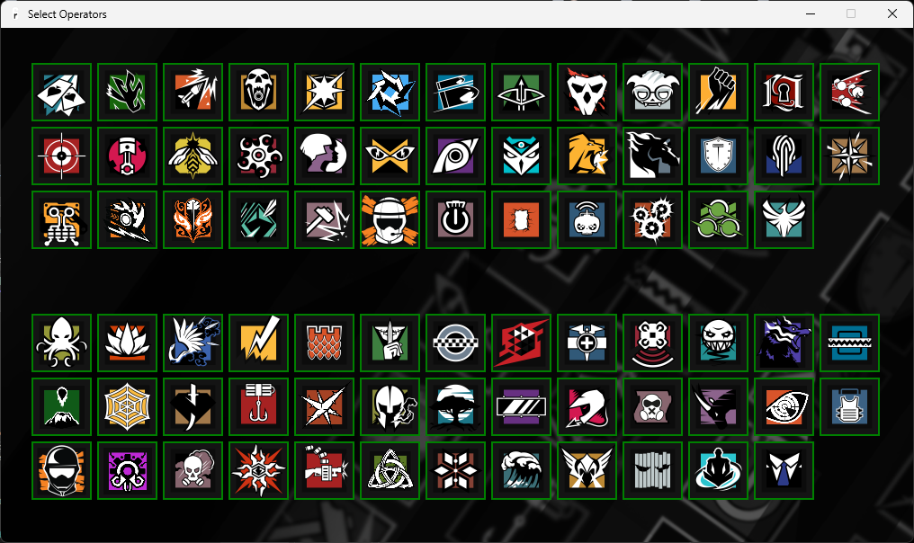

# Rainbow Six Siege Randomizer

---

---

## Downloads
- 
-   
- 

  ---

## Changelog

### v1.2.0
- **YEAR 10 SEASON 3 — Operation High Stakes**
- Added new operator: **Leon "Denari" Winzenried**
- Window is positioned on top and made transparent for an overlay-like look.
- Updated hotkey logic (`Shift + F5` to toggle visibility).
- Note: This is not a true game overlay like Discord, Steam, or NVIDIA Overlays.
- Overlay now starts hidden and locks to the top-right corner of the screen.
- Minor UI improvements and bug fixes.

### v1.1.1
- Minor changes

### v1.1.0
- Operators enabled/disabled state now saves automatically to a config file.
- When reopening the app, previously selected operators are restored.

### v1.0.0
- Initial release.
- Randomize operators for Attackers or Defenders.
- Enable or disable operators in settings.
- Prevents duplicate picks until reset.

--- 

## Screenshots 

### Main Window 
 

### Settings Menu 
 

---

## Overview
The **R6 Randomizer** is your go-to companion for Rainbow Six Siege, helping you pick a random operator for **Attackers** or **Defenders**.  
It’s a quick way to keep your gameplay fresh and unpredictable, with full control over which operators are included.

---

## Key Features

### Randomize Button
- Click **Randomize** to select a random operator from your enabled list.  
- Displays the chosen operator’s portrait and details in the main window.  
- Prevents the same operator from being chosen again until you reset the app.

### Operator Management
- Click **Settings** to view the full operator roster.  
- **Green border** = enabled, **Red border** = disabled.  
- Click an operator’s icon to toggle its status.  
- Changes are **saved automatically** and persist between launches.

### In-Game Overlay
- **Press `Shift + F5`** to toggle the app’s visibility while playing.  
- Designed to work best in **borderless windowed mode** — may not function in exclusive fullscreen.  
- Overlay stays in the top-right corner and can be hidden when not needed.

### Customizable Roster
- All operators are **enabled by default**.  
- Disable any operators you don’t want in the randomization pool.

---

## Troubleshooting

### No Operators Enabled
- You must enable at least one operator for the randomizer to work.

### Image Not Found
- Missing images are shown with a **red background** and a tooltip displaying the missing file path.

### Overlay Not Showing In-Game
- Use **borderless windowed mode** for best results.
- Ensure the hotkey doesn’t conflict with another application.
- Some anti-cheat restrictions may prevent overlay display in exclusive fullscreen.
