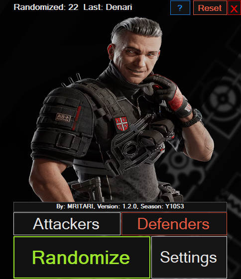

# Rainbow Six Siege Randomizer

## Downloads
You can download the latest version of the **R6 Randomizer** app here:  
- [Download Latest Release (ZIP)](https://github.com/mritari/Rainbow-Six-Siege-Randomizer/releases/latest/download/release.zip)  
- [View All Releases](https://github.com/mritari/Rainbow-Six-Siege-Randomizer/releases)

---

## Overview
The **R6 Randomizer** app allows you to randomly select an operator for **Attackers** or **Defenders** in Rainbow Six Siege.  
You can enable or disable specific operators and view their icons in the settings menu.

---

## Screenshots

### Main Window

### Settings Menu

---

## Main Features

### Randomize Button
- Click **Randomize** to pick a random operator from the currently enabled list.
- The selected operator’s image will appear in the main picture box.

### Attacker / Defender Toggle
- Click **Attackers** or **Defenders** to choose which side the random operator should be selected from.
- Only enabled operators from the chosen side will be included.

### Settings
- Click **Settings** to open the operator list.
- Each operator has an icon:
  - **Green border** = enabled
  - **Red border** = disabled
- Click an operator icon to toggle whether it is included in randomization.
- You can minimize or restore the settings window without losing changes.

### Global Hotkey
- **Press `AltGr + R`** to minimize or restore the main app window while playing the game.
- Works even if Rainbow Six Siege is running in fullscreen.

### Operator List
- All operators are **enabled by default**.
- Disabled operators are skipped in randomization.

### Error Handling
- **No operators enabled** → You must enable at least one operator in settings.
- **Image not found** → The app will warn you if the operator image is missing.

---

## Notes
- Keep the settings window open before starting to ensure all operators are loaded.
- Missing images will be highlighted with a **red background** and a tooltip with the missing file path.
